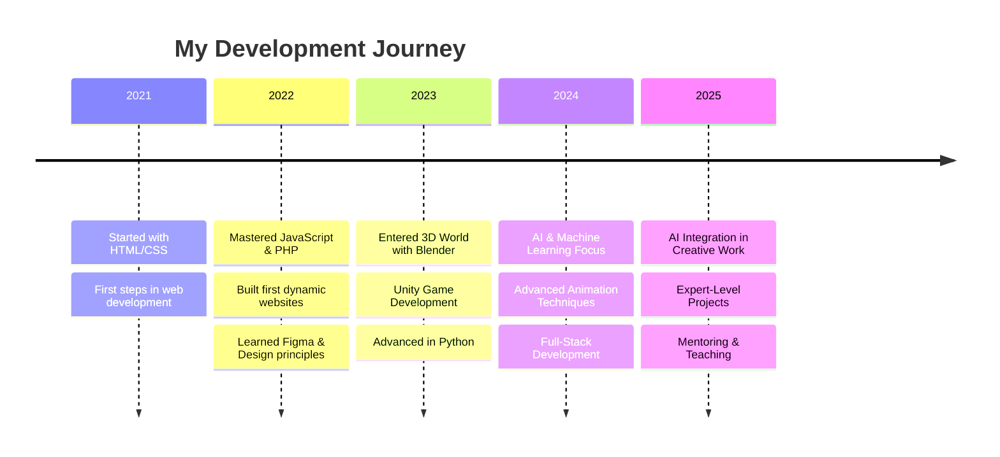

#  Hey there, I'm **M. Adib Al Jabrah**

  

  
    
  
  

---

## 🎯 **About Me**

**🎓 Student at Politeknik Caltex Riau**  
**📍 Based in Pekanbaru, Riau, Indonesia**

Saya adalah mahasiswa yang passionate dalam dunia kreatif dan teknologi. Selama 3 tahun terakhir, saya aktif mengembangkan kemampuan di bidang **desain grafis**, **animasi**, **pemrograman web**, dan **game development**.

**🚀 Currently Exploring:**
- 🧠 AI & Machine Learning  
- 🎥 3D Animation with Blender  
- 🌐 Interactive Web Development  
- 🎮 Game Development with Unity  

**💡 Ask me about:** Web Development, Graphic Design, AI, Animation, Game Development

 

---

## 🛠️ **Tech Arsenal**

### **Frontend Development**

### **Backend Development**

### **Design & Creativity**

### **Game Development & AI**

### **Tools & Environment**

---

## 🎨 **What I'm Passionate About**

| 💻 **Development** | 🎨 **Design** | 🤖 **AI & Innovation** |
|:------------------:|:-------------:|:-----------------------:|
| Building responsive web apps | Creating stunning visual content | Exploring machine learning |
| Clean, efficient code | UI/UX design principles | Automation solutions |
| Problem-solving | Brand identity design | Data visualization |

---

## 🚀 **Current Focus**

```mermaid
graph LR
    A[🧠 AI & Machine Learning] --> B[🎥 3D Animation]
    B --> C[🌐 Interactive Web Design]
    C --> D[🎮 Game Development]
    D --> A
    
    style A fill:#ff6b6b
    style B fill:#4ecdc4
    style C fill:#45b7d1
    style D fill:#96ceb4
```

---

## 📈 **Professional Journey**

---

## 🌟 **Fun Facts & Interests**

- 🎨 **Creative Mindset**: I believe every problem has a beautiful solution
- 🌙 **Night Owl**: My best code is written after midnight
- ☕ **Coffee Addict**: Powered by caffeine and creativity
- 🎮 **Gamer**: Understanding user experience through gaming
- 📚 **Lifelong Learner**: Always exploring new technologies
- 🎬 **Content Creator**: Bringing stories to life through animation

 

---

## 🤝 **Let's Connect & Collaborate**

---

## 💭 **Quote That Inspires Me**

  
> ### *"God Did"*
> 
> *— A reminder that with faith, dedication, and hard work, amazing things are possible*

---
